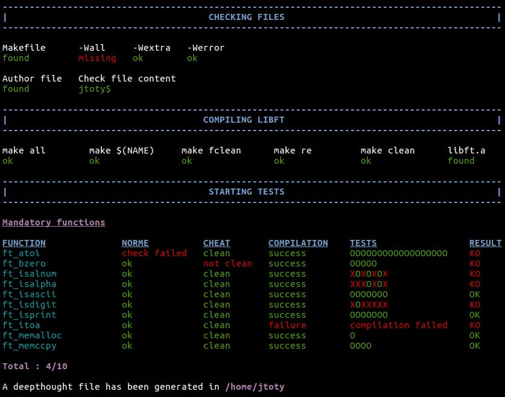

# Libftest

This repository contains script to test your libft project.  
The script will do the following tests :
- Check if the author file exists
- Check content of the author file
- Check if the Makefile file exists
- Check rules in Makefile
- Check compilation's flag in Makefile
- Compil library
- Check norme errors
- Check forbidden functions
- Tests functions

At the end of the tests, a deepthought file will be created, inside which you
can find all the results and error/failure messages.

The script will compil your files with your libft, so you must have your
Makefile up to date.

:warning:All the tests made are not the official tests:warning:

## Getting Started

### Installation

```bash
git clone https://github.com/jtoty/grademe
```

### Configuration

If you run the script for the first time, it will automatically create
`your_config.sh` file and ask you to edit it with the path of your libft
project.  
You can also choose the colors that will be used and the path where the
deepthought file will be created.

## Running script

Go to the directory where you cloned and run the script
```bash
bash grademe.sh
```
or simply run the script with the path
```bash
bash /path/where/you/cloned/grademe.sh
```

### Options available
| Option | Description |
| --- | --- |
| `-c`<br />`--no-color` | Disable color |
| `-s`<br />`--no-search` | Disable searching Makefile and author files |
| `-q`<br />`--quick-lib` <br />&nbsp;&nbsp;&nbsp;&nbsp;&nbsp;&nbsp;&nbsp;&nbsp;&nbsp;&nbsp;&nbsp;&nbsp;&nbsp;&nbsp;&nbsp;&nbsp;&nbsp;&nbsp;&nbsp;&nbsp;&nbsp;&nbsp;&nbsp;&nbsp;&nbsp;&nbsp;&nbsp;&nbsp;&nbsp;&nbsp; | When compiling library, do only `make re`. It may be useful on slower devices, such as Raspberry Pi, to avoid to wait too long for all the tests. However, other rules are still checked if they exist (but they are not tested). |
| `-l`<br /> `--no-library` | Disable compiling library |
| `-f`<br />`--no-forbidden` | Disable checking forbidden functions |
| `-n`<br />`--no-norminette` | Disable norminette |
| `-u`<br />`--no-update` | Disable checking updates at launch |
| `-m`<br />`--no-mandatory`| Disable mandatory part tests |
| `ft_function-name` | Test only this function |
<!-- `-b`,`--no-bonus`  Disable bonus part tests  -->
<!-- `-a`,`--no-additional` Disable additional part tests -->

Add successively all options you want, in the order you want.
For example :
```bash
bash grademe.sh ft_atoi --no-color ft_strlen -n
```

## Contribution

Any suggestions or bugs reporting ?
Contact jtoty@student.42.fr

### Contributors
jmichaud : https://github.com/MrJe
achauvea
