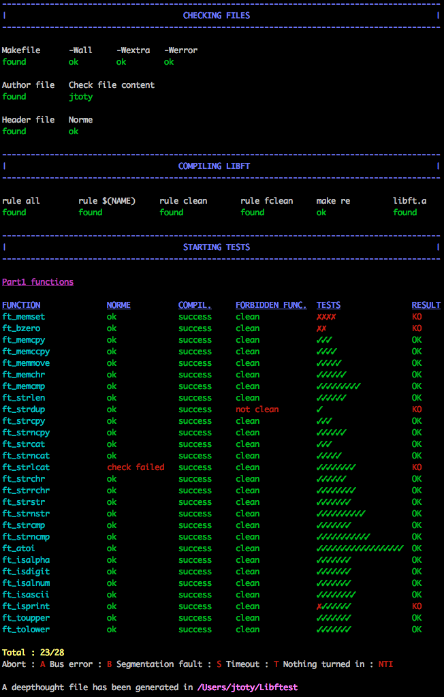

# Libftest

This repository contains script to test your libft project.
The script will do the following tests :

- Check if libft.h exists
- Check norme of libft.h
- Check if the Makefile file exists
- Check rules in Makefile
- Check compilation's flag in Makefile
- Compil library
- Check norme errors
- Check forbidden functions
- Tests functions

At the end of the tests, a deepthought file will be created, inside which you
can find all the results and error/failure messages. You can also see your
results in tests directory.

The script will compil your files with your libft, so you must have your
Makefile up to date.

:warning:All the tests made are not the official tests:warning:

## Getting Started

### Installation

```bash
git clone https://github.com/jtoty/Libftest
```

#### Old libft subject
To test the old libft subject, you have to go to the branch [old-libft](https://github.com/jtoty/Libftest/tree/old-libft).

### Configuration

If you run the script for the first time, it will automatically create
`my_config.sh` file and ask you to edit it with the path of your libft
project.
You can also choose the colors that will be used and the path where the
deepthought file will be created.

## Running script

Run the script from the directory where you cloned
```bash
bash grademe.sh
```
or run the script with the path
```bash
bash /path/where/you/cloned/grademe.sh
```

### Options available
| Option | Description |
| --- | --- |
| `-h`<br />`--help` | Display help and exit |
| `-c` | Disable color |
| `-s` | Disable searching Makefile and author files |
| `-m` | When compiling library, test all the Makefile's rules (instead of doing only make re and checking if other rules exist). |
| `-l` | Disable compiling library |
| `-f` | Disable checking forbidden functions |
| `-n` | Disable norminette |
| `-u` | Disable checking updates at launch |
| `-p1` | Disable part 1 tests |
| `-p2` | Disable part 2 tests |
| `-b`| Disable bonus part tests |
| `-a` | Disable additional part tests |
| `-op1`| Do only part 1 tests |
| `-op2`| Do only part 2 tests |
| `-ob` | Do only bonus part tests |
| `-oa` | Do only additional part tests |
| `ft_function` | Test only this function |

Add successively all options you want, in the order you want.
For example :
```bash
bash grademe.sh ft_atoi -f ft_strlen -n
```

### Supported functions
All the supported functions are listed [on this page](https://github.com/jtoty/Libftest/blob/master/supported_functions.md).
## Contribution

Any suggestions or bugs reporting ?
Contact jtoty@student.42.fr

### Contributors
- jmichaud : https://github.com/MrJe
- tlernoul
